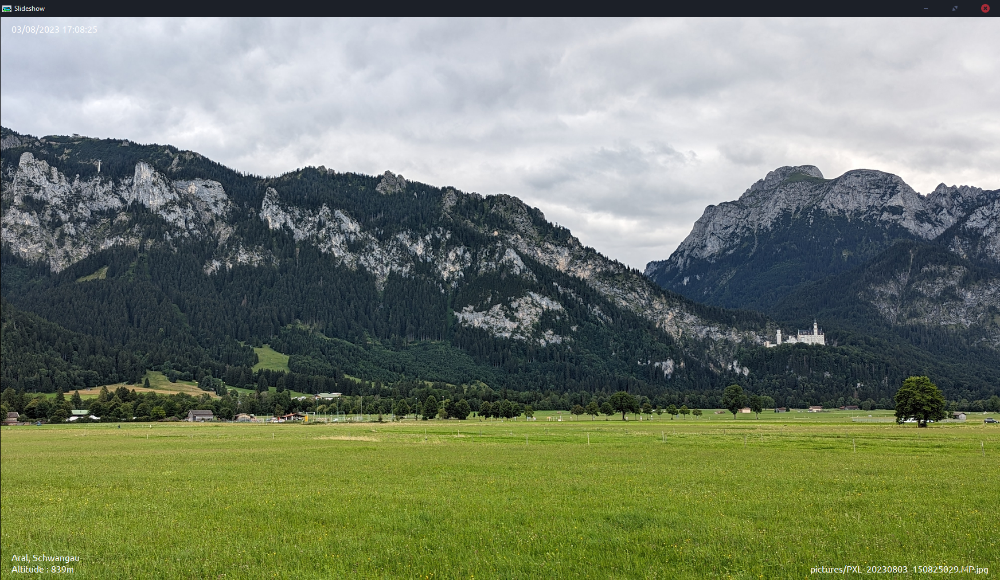
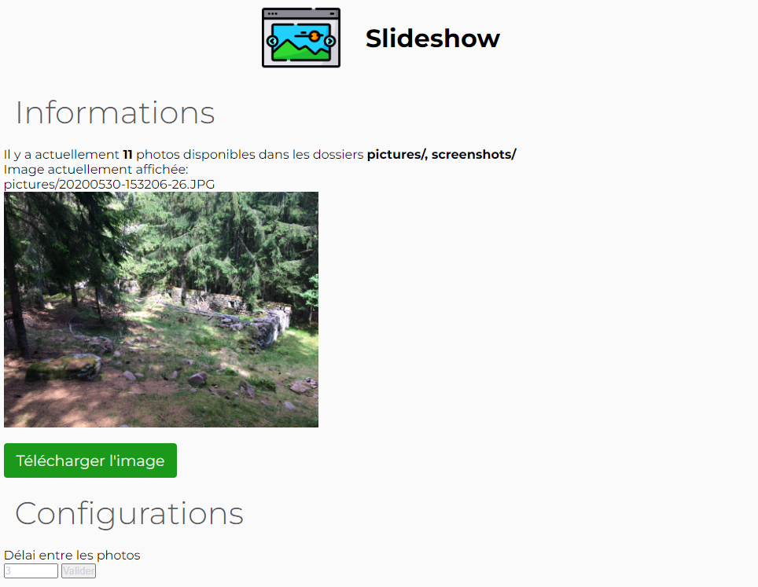
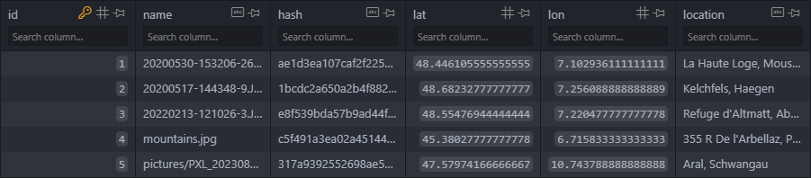

<p align="center">
    
</p>

<h1 align="center" style="font-size: 50px;">Welcome to SlideshowMemories project 👋</h1>

[](https://www.paypal.me/QuentiumYT/1)&nbsp;
[](https://github.com/QuentiumYT/SlideshowMemories/pulls)&nbsp;
[](https://www.python.org/downloads)&nbsp;
[](https://github.com/QuentiumYT/SlideshowMemories/blob/master/LICENSE)&nbsp;
[![Size](https://img.shields.io/github/repo-size/QuentiumYT/SlideshowMemories?label=Repo%20Size&color=4391BD&logo=data:image/png;base64,iVBORw0KGgoAAAANSUhEUgAAAFAAAABQCAYAAACOEfKtAAAAAXNSR0IArs4c6QAAAARnQU1BAACxjwv8YQUAAAAJcEhZcwAADsMAAA7DAcdvqGQAAAUCSURBVHhe7ZzdbhtFFMfPru3ECSFtYlqhVKK9IQ0Iil0JAilIhSTQPgHPwVWBB2hRVcFzcAG3CNIIJIgrxEeqctPSXvWioh/5aBJok6Zr5r/rTdeb2fjs7tjZmfXvZsdeS9H8dM6cc9aKqUePHjpjNa+5YPbiQtV27Evbjv3x/OeTS823U2E3r8bTlHdZLKeLduPy9PlfK96ddORC4NkL9ZqQNy+WFdvGlhvVou3MffRlfdT9QAqMF4jIcyxrTixHX3zhAM1OvU7PDw3gVo227Pm0kWj0GRhI2wrkTZ54mRCBj7ee0C9/Xqf1jUfilnV127Fmkp6JxgqMkuejSqKRKTx9sX5GyFsQS6k8UO4r0bsnJ5rpjDMxWWExTiAir+RY34rlYLFYoOorx3bJ81Eh0SiBfto2iAYgb3v7KdUXb9KmSNco0ko0RmD4zJt55zUaHhqktY3/6MrVm96HIkgj0QiBsoIx0N8vpByng8PPiRRuXyuTStS+CrertnGJW521jsCgvFKbgsElbiRqKzAs7wmjYHCJI1FLgbsKxtvPCsbPf1ynx5vdk6idQNmZVy57BQMS1/995J5h3ZKolcAPv7hy1nLsulhWxg6N0OQb4ztnXr+72WcSFxZvKEvnU9VxKrh/BxKdr707HtoIdCOP6BvRNrhN8omJl8i2WpuIoERO/8fBaTTo2o3b9NRxxCtr1bHsT707HoXmNdME0nbYnzDuLa/TkcMjVCy0bgGv8f79lXU3ao6OHWreiQ/k/XbtFt25vyJeQZ41O3du8nfvrkfm+8DwmYdWBdUWETYyPESn33rV+6BiOPJAplNYVjDiThhJ4MoDmY1Amby0TTKHOPJAJiMwKE/VhMEhrjyQuSISlocJI6pgqCSJPJApgeG0Rf8FeSgY/zx4SGOHRwlVWDVJ5YHMCJSdeaVSyY28u0trbnN8d0m9xDTyQCYE4juMgmN/L5YHwgXD7+t8ifeW15Slc1p5YN8FIvKKjv2DWLrfYUzVxqlPRF6QoESk84OVDTp2JHmDDFTIA/sqMJC2mZswuOxbHxg+87I2YXDZlz5QVjCyNmFw6XoEyuRltUnm0NUIDMrL+oTBpWtFJCwv6xMGl64IDKetDhMGl44LlJ15OkwYXDoqUOcJg0vHBCLydJ4wuHREYCBttZ0wuCjvA8Nnnq4TBhelTZisYOg6YXBRtiOZPN2bZA5KdhiUZ8qEwSV1EQnLM2XC4JJqh+G0NWnC4JJ4d7Izz6QJg0uineVhwuASe1eIvDxMGFxiCQykrfETBhd2Hxg+80yfMLiwmjVZwTB9wuDSducyeXlpkjnsaSIoL28TBpfIIhKWl7cJg4vURDht8zhhcNllQXbm5XHC4NJiYK+CEWyOVUvUVR7Y2f1e8nzCEpdWzZ0wuOwYEvIuiUsFU0N1Irra+v/MoqL/a5VHy3bD+UAneWDHwOmvfjzYv1nGjPvm0GCZ3js5QeVyn3ezA+geeT4tIdQtiabIA7tysNMSTZIHpIdYpySaJg9EVgHVEk2UByIFAlUSTZUH9hQI0ko0WR5oKxAklWi6PMASCOJKzIM8wBYIuBLzIg/EEgjaScyTPBBbIIiSmDd5IJFAEJZ4qnac/vr7dq7kgcQCgfsruFsWHoHV8PTGcX8aBE9VGjPffTa1iBemk0ogCEZiniLPJ/VXbD998v4q9TXOiOW8js/zevTQGaL/Af3ei59A3O7oAAAAAElFTkSuQmCC)](../../)&nbsp;

## ✨ Introduction

SlideshowMemories is another slideshow program written in Python. It is designed to be simple and easy to use, but also have some advanced features like a web interface and a database.

It has been created to display family memories on a Raspberry Pi with an external screen, displaying every picture inside the `pictures/` folder. It can also display the location of the picture using an API (positionstack).

Everything should work without any setup (except installing dependencies), but you can also configure it to your needs.

⚠️ Translations are planned soon (few in slide.py and more in the web), every string is in french, you'll have to deal with it for now :p

## 🚀 Features

- Slideshow using tkinter ➤ A lite but powerful slideshow to show your pictures
- Web interface in flask ➤ A web interface to display info and control the slideshow
- Location API ➤ Get the location of the picture shown using an API
- Database in sqlite ➤ A database to store pictures and their location (and more in the future)
- Configuration ➤ You can configure the slideshow to your needs within the code (simple methods arguments)

*Soon, a new module will be added to watch for USB drives plugged in and automatically load pictures for the slideshow.*

## 📥 Installation

```bash
git clone https://github.com/QuentiumYT/SlideshowMemories.git
cd SlideshowMemories/
pip install -r requirements.txt
python main.py
```

## 📝 Configuration

Copy the .env.example file to .env and fill it with your values.

🚩 A config file is planned to be added soon.

## 📷 Preview

**Slideshow preview**


**Website preview**


**Database preview**


## 📚 Documentation

Later :) You can check the code, it is documented.

## 🤝 Contributing

Pull requests are welcome and please report any issues you find in [issues](https://github.com/QuentiumYT/SlideshowMemories/issues). For major changes, please open an issue first to discuss what you would like to change or create a new branch.

Please make sure to test your suggestions before committing.

## 👤 Author

**Quentin L.**

- Website: [quentium.fr](https://quentium.fr/)
- Twitter: [@QuentiumYT](https://twitter.com/QuentiumYT)
- Contact: [Mail](mailto:pro@quentium.fr?subject=[Slideshow]%20Contact%20for%20...)

Please ✰ this repository if this project helped you!

## 📖 License

[MIT](https://choosealicense.com/licenses/mit/)

---

_Made with_ ❤ _by QuentiumYT_
